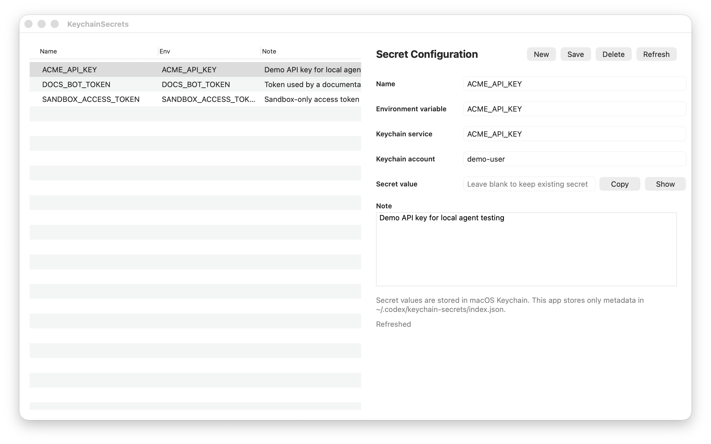

# Keychain Secrets

Manage local API keys and agent credentials with macOS Keychain. Secret values are stored in Keychain; this skill keeps only metadata such as the environment variable name, Keychain service/account, and notes in `~/Library/Application Support/KeychainSecrets/index.json`.



The screenshot uses mock metadata only. It does not contain real secret names or values.

## Install The App

```bash
python scripts/keychain_secrets.py app
```

The native app is installed at:

```text
~/Applications/KeychainSecrets.app
```

Open it later with:

```bash
open "$HOME/Applications/KeychainSecrets.app"
```

## CLI Usage

Store or update a secret without putting the value in shell history:

```bash
python scripts/keychain_secrets.py put OPENAI_API_KEY --prompt --note "OpenAI key for local agents"
```

List managed secrets and metadata:

```bash
python scripts/keychain_secrets.py list
```

Run a command with selected secrets injected as environment variables:

```bash
python scripts/keychain_secrets.py run OPENAI_API_KEY -- env | grep OPENAI_API_KEY
```

Delete a managed secret:

```bash
python scripts/keychain_secrets.py delete OPENAI_API_KEY
```

## Native App

Use the app to create, update, reveal, copy, and delete managed entries. The secret field is blank by default when an existing entry is loaded; leave it blank to keep the existing Keychain value while editing metadata.

The app reads metadata from `~/Library/Application Support/KeychainSecrets/index.json` and stores secret values in macOS Keychain. It does not render secret values unless you click `Show`, and it never stores secret values in the metadata file.

## Development

Build and reinstall the app:

```bash
scripts/keychain_secrets.py install-app
```

For documentation screenshots or local UI testing, point the app at a mock metadata file:

```bash
KEYCHAIN_SECRETS_INDEX_PATH=/path/to/mock-index.json \
  "$HOME/Applications/KeychainSecrets.app/Contents/MacOS/KeychainSecrets"
```

This override only changes where the app reads metadata. It does not change where secrets are stored.

The CLI honors the same `KEYCHAIN_SECRETS_INDEX_PATH` override. Entries from the legacy `~/.codex/keychain-secrets/index.json` location are migrated automatically on first run.

## License

[MIT](LICENSE)
